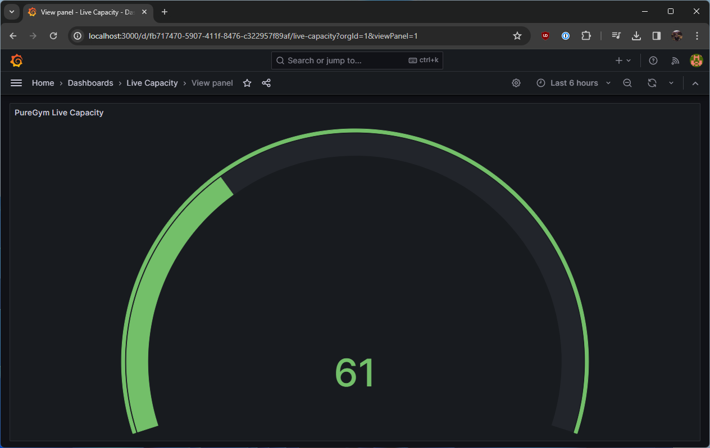

<p align="center">
  
</p>

<h1 align="center">
    PureGym Capacity Checker
</h1>
<p align="center">A simple application that exposes PureGym metrics to Prometheus</p>

<p align="center">
  
</p>

## Motivation

This project makes use of my [puregym-go](https://github.com/jackcoble/puregym-go/) API client to query for data about my local gym. I created this project as an alternative way to view Live Capacity information about the gym, and to give myself the ability to experiment with some new tools - primarily Prometheus and Grafana!

## Getting Started

There are a few environment variables required for the application to be able to run correctly. They can be found in the [env.sample](https://github.com/jackcoble/puregym-capacity/blob/main/env.sample) file.

I personally use Docker to spin up everything I need for this to run correctly, so I would advise you do the same! 😊

```bash
$ docker-compose up -d --build
```

Once up and running, you'll need to edit the `prometheus.yml` configuration and update the targets.

```yml
static_configs:
  - targets: ["puregym_capacity:2222"]
```

Give the containers a restart and then Prometheus should be picking up the metrics from the application!

```bash
$ docker-compose restart
```
